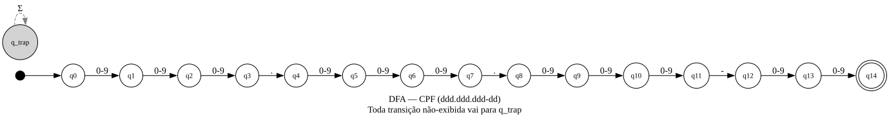
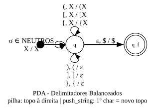
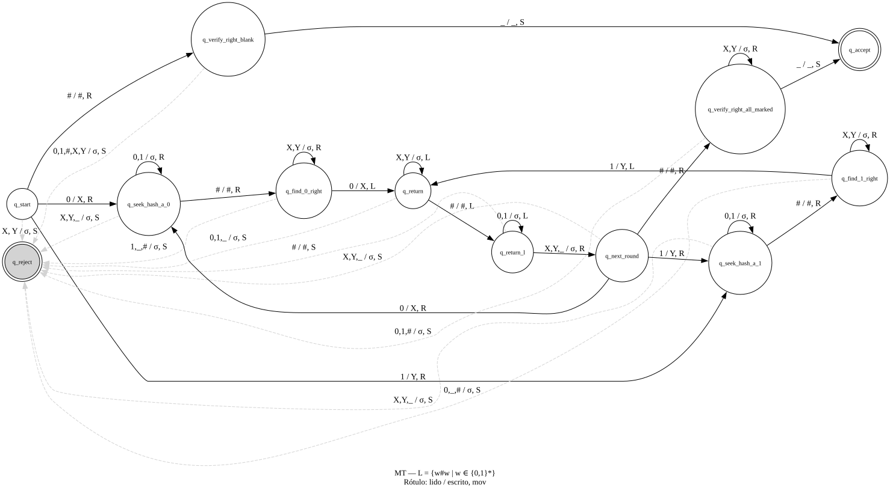
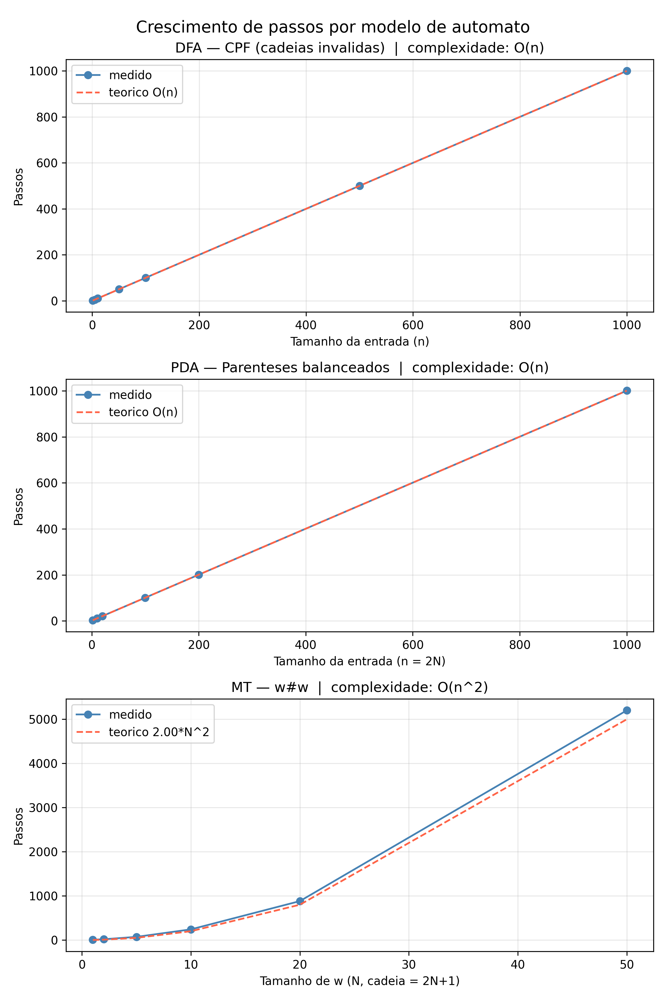

# Projeto Final — Linguagens Formais e Autômatos

**Tema 1 — Cadastro, fórmulas e integridade**

---

## 1. Introdução e contexto aplicado

Sistemas de software que processam dados estruturados dependem de validadores formais para garantir a integridade da entrada antes de qualquer processamento. Um número de CPF mal formatado, um par de parênteses desbalanceado em uma fórmula ou uma sequência que viola restrições estruturais são classes de erros detectáveis sem execução semântica — apenas por reconhecimento de padrão.

Este trabalho implementa três reconhecedores sobre o tema "Cadastro, fórmulas e integridade", cada um correspondendo a um nível distinto da hierarquia de Chomsky:

| Nível | Linguagem reconhecida | Modelo |
|---|---|---|
| **LR** — Regular | CPF no formato `ddd.ddd.ddd-dd` | DFA |
| **LLC** — Livre de Contexto | Delimitadores `()`, `[]`, `{}` balanceados | PDA |
| **R** — Recursiva | `L = {w#w | w ∈ {0,1}*}` | Máquina de Turing |

A hierarquia estrita LR ⊊ LLC ⊊ R é demonstrada tanto pelos modelos formais quanto pela evidência empírica da complexidade de reconhecimento, discutida na Seção 8.

Cada reconhecedor é implementado como simulador explícito do autômato — a tabela de transição é declarada como dado, e o simulador a executa passo a passo, contabilizando cada evento do autômato.

---

## 2. Linguagem Regular — CPF

### Definição

A linguagem LR_CPF é o conjunto de todas as cadeias no formato textual de CPF brasileiro: três dígitos, ponto, três dígitos, ponto, três dígitos, hífen, dois dígitos.

$$L_{CPF} = \{ d_1d_2d_3\text{.}d_4d_5d_6\text{.}d_7d_8d_9\text{-}d_{10}d_{11} \mid d_i \in \{0,\ldots,9\} \}$$

**Decisão de projeto:** o reconhecedor valida apenas o formato textual. Verificar os dígitos verificadores exigiria aritmética modular, tornando o problema não-regular.

**Alfabeto:** Σ = {0, 1, 2, 3, 4, 5, 6, 7, 8, 9, `.`, `-`}

### Autômato

O DFA possui **16 estados**: q0 a q14 (fluxo linear, um por posição da cadeia) e q\_trap (estado sumidouro).

- **Estado inicial:** q0
- **Estado de aceitação:** {q14}
- **Trap:** q\_trap absorve qualquer símbolo após falha, incluindo símbolos fora de Σ

A tabela de transição é construída programaticamente a partir do padrão posicional `['D','D','D','.','D','D','D','.','D','D','D','-','D','D']`, onde `D` representa qualquer dígito. Nenhuma entrada é escrita manualmente.



### Exemplos

| Cadeia | Resultado | Passos |
|---|---|---|
| `123.456.789-00` | aceita | 14 |
| `000.000.000-00` | aceita | 14 |
| `999.888.777-66` | aceita | 14 |
| `12.345.678-90` | rejeita (só 2 dígitos no 1º grupo) | 13 |
| `123-456-789.00` | rejeita (pontuação incorreta) | 14 |
| `12a.456.789-00` | rejeita (letra no meio) | 14 |

---

## 3. Linguagem Livre de Contexto — Parênteses balanceados

### Definição

A linguagem LLC\_BAL é o conjunto de expressões simbólicas em que os delimitadores `()`, `[]` e `{}` estão corretamente balanceados e aninhados. O alfabeto inclui também letras, dígitos, operadores e espaço.

**Gramática Livre de Contexto equivalente:**

```
S → S S | ( S ) | [ S ] | { S } | T | ε
T → letra | dígito | operador | espaço | T T
```

**Decisão de projeto:** a cadeia vazia é aceita (`S → ε`), pois representa uma expressão válida sem delimitadores. O critério é puramente sintático — pareamento correto — sem exigência semântica de conteúdo.

**Alfabeto:** Σ = `{(, ), [, ], {, }, a-z, A-Z, 0-9, +, -, *, /, espaço}`

### Autômato

O PDA possui **2 estados**: q (operacional) e q\_f (aceitação). O símbolo `$` marca o fundo da pilha.

- **Estado inicial:** q
- **Estado de aceitação:** {q\_f}
- **Transições principais:**
  - Ler abridor → empilha o abridor (qualquer topo)
  - Ler fechador → desempilha **apenas** se o topo for o abridor correspondente
  - Símbolo neutro → consome sem alterar a pilha
  - ε-transição `(q, ε, $) → (q_f, $)` — dispara somente quando a pilha está no fundo

A ε-transição condicional é a peça-chave: garante que cadeias com abridores não fechados (ex: `(((`) permaneçam em q ao final — o topo não é `$`, a transição não dispara, o BFS não encontra q\_f.

> **Caso crítico: `([)]`**
> Este caso distingue um PDA com pilha tipada de uma abordagem ingênua que "conta abridores".
> Ao ler `)` com topo `[` na pilha, nenhuma transição está definida — o BFS não encontra
> caminho aceitante. Uma solução baseada em contador aceitaria erroneamente esta cadeia.



### Exemplos

| Cadeia | Resultado | Passos |
|---|---|---|
| `((x+y)*z)` | aceita | 10 |
| `{[()]}` | aceita (aninhamento triplo) | 7 |
| `()()` | aceita (concatenação no topo) | 5 |
| `` (vazia) | aceita | 1 |
| `((a+b)` | rejeita (abridor sem fechar) | 6 |
| `([)]` | rejeita (pareamento cruzado) | 2 |

---

## 4. Linguagem Recursiva — w#w

### Definição

$$L_{ww} = \{ w\#w \mid w \in \{0,1\}^* \}$$

A linguagem contém cadeias em que uma sequência binária `w` aparece duas vezes, separadas por `#`. O caso `w = ε` resulta na cadeia `#`, que é aceita.

**Alfabeto de entrada:** Σ = {0, 1, #}

**Alfabeto da fita:** Γ = {0, 1, #, X, Y, \_} — onde X marca 0 comparado, Y marca 1 comparado, \_ é branco

### Autômato

A MT possui **10 estados operacionais** mais 2 estados de parada (`q_accept` e `q_reject`), totalizando 12 estados:

| Estado | Função |
|---|---|
| q\_start | lê o 1º símbolo; marca X/Y ou trata w=ε |
| q\_seek\_hash\_a\_0, q\_seek\_hash\_a\_1 | avança R até o `#` |
| q\_find\_0\_right, q\_find\_1\_right | localiza o correspondente não-marcado à direita |
| q\_return | retorno — lado direito do `#`, passa por X/Y marcados |
| q\_return\_l | retorno — lado esquerdo, passa por 0/1 não-marcados |
| q\_next\_round | lê próximo símbolo não-marcado à esquerda |
| q\_verify\_right\_blank | confirma w=ε (só branco à direita do `#`) |
| q\_verify\_right\_all\_marked | confirma que toda a direita foi marcada |
| q\_accept, q\_reject | parada |

**Decisão de projeto — por que 12 estados e não 11:**

O algoritmo clássico de correspondência par-a-par usa um estado único de retorno que avança à esquerda até encontrar um marcador X/Y. Este estado funciona para w de comprimento 1, mas falha na 2ª rodada: após marcar o primeiro par, a fita à direita do `#` já contém X/Y; o estado de retorno encontra esses marcadores antes de cruzar o `#` e transita prematuramente para o próximo estado.

O caso `00#00` revelou o bug: na 2ª rodada, o retorno parava no X recém-marcado no lado direito, fazendo `q_next_round` rejeitar ao ler X (já processado). A solução é dividir o retorno em duas fases:

- **q\_return** — lado direito do `#`: passa por X/Y sem parar; ao cruzar `#`, transita para q\_return\_l
- **q\_return\_l** — lado esquerdo: passa por 0/1 não-marcados; para ao encontrar X/Y (limite do que já foi processado)



### Exemplos

| Cadeia | Resultado | Passos |
|---|---|---|
| `#` | aceita (w = ε) | 2 |
| `01#01` | aceita | 18 |
| `1101#1101` | aceita | 50 |
| `` (vazia) | rejeita (sem `#`) | 1 |
| `0#1` | rejeita (w diferente) | 3 |
| `0##0` | rejeita (múltiplos `#`) | 3 |

---

## 5. Modelos formais consolidados

| Propriedade | DFA (CPF) | PDA (parênteses) | MT (w#w) |
|---|---|---|---|
| Estados | 16 (q0–q14 + q\_trap) | 2 (q, q\_f) | 10 op. + 2 halt = 12 |
| Alfabeto entrada | {0–9, `.`, `-`} | {`()[]{}`, letras, dígitos, op., espaço} | {0, 1, #} |
| Memória auxiliar | nenhuma | pilha (fundo `$`) | fita bidirecional |
| Complexidade | O(n) — linear | O(n) — linear | O(n²) — quadrático |
| Determinístico? | sim | sim (via BFS sem ramificação real) | sim |

**Amostra de transições:**

```
DFA:   (q3, '.') -> q4       # posição do 1º ponto
PDA:   (q, '(', '$') -> (q, '($')   # empilha abridor
MT:    (q_start, '0') -> (q_seek_hash_a_0, 'X', R)  # marca e avança
```

---

## 6. Implementação

### Arquitetura

Todos os reconhecedores compartilham três classes base em `src/automato/`:

- **`DFA`** — recebe `delta: dict[tuple[str,str], str]`, executa leitura símbolo a símbolo. Suporta `trap` para absorver símbolos fora do alfabeto sem exceção.
- **`PDA`** — recebe `delta: dict[tuple[str,str,str], set[tuple[str,str]]]`, executa BFS sobre configurações `(estado, posição, pilha)`. O conjunto de visitados elimina loops em ε-transições.
- **`MT`** — recebe `delta: dict[tuple[str,str], tuple[str,str,str]]`, simula fita com expansão dinâmica em ambas as direções. `max_steps = 100.000` protege contra loops.

Cada reconhecedor (`regular.py`, `livre_contexto.py`, `recursiva.py`) importa a classe base e fornece sua tabela de transição — declarada como estrutura de dados, não como cadeia de `if/elif`.

### Contagem de passos

Conforme exigência do enunciado, o contador incrementa por **evento do autômato**, não por iteração Python:

- DFA: cada leitura de símbolo
- PDA: cada transição aplicada (push, pop, ε incluída)
- MT: cada movimento da cabeça (L, R ou S)

### Restrição ao módulo `re`

O módulo `re` é proibido como reconhecedor principal. Ele aparece exclusivamente em `src/bonus_dfa_vs_re.py`, que demonstra a equivalência entre o DFA manual e `re.fullmatch` como comparação opcional.

---

## 7. Testes e resultados

### Bateria de testes

| Linguagem | Aceitas | Rejeitadas | Total | Resultado |
|---|---|---|---|---|
| LR — CPF | 3 | 6 | 9 | 9/9 ✓ |
| LLC — Parênteses | 6 | 6 | 12 | 12/12 ✓ |
| R — w#w | 6 | 7 | 13 | 13/13 ✓ |
| **Total** | **15** | **19** | **34** | **34/34 ✓** |

Além da bateria unificada, 92 testes pytest cobrem as classes base e os reconhecedores individualmente, incluindo testes estruturais (número de estados, alfabetos, ausência de transições cruzadas) e casos críticos nomeados.

### Passo a passo — LR: `123.456.789-00` (aceita, 14 passos)

```
inicio: estado=q0
passo 1:  (q0,  '1') -> q1
passo 2:  (q1,  '2') -> q2
passo 3:  (q2,  '3') -> q3
passo 4:  (q3,  '.') -> q4
passo 5:  (q4,  '4') -> q5
...
passo 12: (q11, '-') -> q12
passo 13: (q12, '0') -> q13
passo 14: (q13, '0') -> q14
resultado: aceita (estado final=q14)
```

### Passo a passo — LR: `12.345.678-90` (rejeita, 13 passos)

```
inicio: estado=q0
passo 1: (q0, '1') -> q1
passo 2: (q1, '2') -> q2
passo 3: (q2, '.') -> q_trap   ← falha: esperava 3º dígito
passo 4: (q_trap, '3') -> q_trap
...  [trap absorve os 10 símbolos restantes]
passo 13: (q_trap, '0') -> q_trap
resultado: rejeita (estado final=q_trap)
```

### Passo a passo — LLC: `({a+b})` (aceita, 8 passos)

```
inicio: estado=q  pilha=['$']
passo 1: (q, '(', '$') -> (q, '($')  pilha=['$', '(']
passo 2: (q, '{', '(') -> (q, '{(')  pilha=['$', '(', '{']
passo 3: (q, 'a', '{') -> (q, '{')   pilha=['$', '(', '{']  ← neutro
passo 4: (q, '+', '{') -> (q, '{')   pilha=['$', '(', '{']  ← neutro
passo 5: (q, 'b', '{') -> (q, '{')   pilha=['$', '(', '{']  ← neutro
passo 6: (q, '}', '{') -> (q, ε)     pilha=['$', '(']       ← pop '{'
passo 7: (q, ')', '(') -> (q, ε)     pilha=['$']            ← pop '('
passo 8: (q,  ε,  '$') -> (q_f, '$') pilha=['$']            ← ε-transição
resultado: aceita
```

### Passo a passo — LLC: `((a+b)` (rejeita, 6 passos)

```
inicio: estado=q  pilha=['$']
passo 1: (q, '(', '$') -> (q, '($')  pilha=['$', '(']
passo 2: (q, '(', '(') -> (q, '((')  pilha=['$', '(', '(']
passo 3–5: neutros a, +, b           pilha=['$', '(', '(']
passo 6: (q, ')', '(') -> (q, ε)     pilha=['$', '(']   ← fecha 1 abridor
[entrada consumida; topo='(' ≠ '$'; ε-transição não dispara]
resultado: rejeita
```

### Passo a passo — MT: `01#01` (aceita, 18 passos)

```
inicio: q_start  fita=01#01  cabeça=0
passo 1:  (q_start,        '0') -> (q_seek_hash_a_0, 'X', R)  fita=X1#01
passo 2:  (q_seek_hash_a_0,'1') -> (q_seek_hash_a_0, '1', R)  fita=X1#01
passo 3:  (q_seek_hash_a_0,'#') -> (q_find_0_right,  '#', R)  fita=X1#01
passo 4:  (q_find_0_right, '0') -> (q_return,        'X', L)  fita=X1#X1
passo 5:  (q_return,       '#') -> (q_return_l,      '#', L)  ← cruza #
passo 6:  (q_return_l,     '1') -> (q_return_l,      '1', L)  ← passa 1
passo 7:  (q_return_l,     'X') -> (q_next_round,    'X', R)  ← borda
passo 8:  (q_next_round,   '1') -> (q_seek_hash_a_1, 'Y', R)  fita=XY#X1
passo 9–11: busca e marca '1' à direita          fita=XY#XY
passo 12–14: retorno fase 1 (direita) e fase 2 (esquerda)
passo 15: (q_next_round, '#') -> (q_verify_right_all_marked, '#', R)
passo 16–17: verifica X, Y à direita
passo 18: (q_verify_right_all_marked, '_') -> (q_accept, '_', S)
resultado: aceita
```

### Passo a passo — MT: `0#1` (rejeita, 3 passos)

```
inicio: q_start  fita=0#1  cabeça=0
passo 1: (q_start,        '0') -> (q_seek_hash_a_0, 'X', R)  fita=X#1
passo 2: (q_seek_hash_a_0,'#') -> (q_find_0_right,  '#', R)  fita=X#1
passo 3: (q_find_0_right, '1') -> (q_reject, '1', S)   ← mismatch: esperava '0'
resultado: rejeita
```

---

## 8. Comparação entre os três níveis

### Por que LR não reconhece parênteses balanceados

Um DFA tem memória finita — seu estado encapsula todo o conhecimento acumulado sobre a entrada lida até o momento. Para reconhecer parênteses balanceados arbitrariamente aninhados, seria necessário contar o nível de aninhamento, que pode crescer sem limite. Com finitos estados, um DFA necessariamente confunde cadeias com profundidades de aninhamento distintas. Formalmente, pelo Lema do Bombeamento para linguagens regulares, LLC\_BAL não é regular.

### Por que LLC não reconhece w#w

O PDA usa uma pilha LIFO. Para verificar `w#w`, seria necessário armazenar `w` na pilha durante a leitura da primeira metade e compará-la com a segunda metade. O problema: a pilha inverte a ordem — o topo contém o último símbolo empilhado. Ao comparar com a segunda metade (na ordem original), os símbolos chegam em ordem inversa. Não há mecanismo na pilha para restaurar a ordem original sem usar uma segunda pilha — o que não é um PDA padrão.

### Por que MT reconhece ambas

A Máquina de Turing dispõe de fita bidirecional com cabeça de leitura/escrita móvel. Isso permite:

1. **Parênteses:** empilhar na própria fita com marcação explícita (embora o PDA seja mais simples para este caso).
2. **w#w:** mover a cabeça para frente e para trás, marcar símbolos já comparados (X/Y), e repetir até que toda a correspondência seja verificada — sem inversão de ordem.

### Evidência empírica — crescimento de passos

Os dados abaixo foram obtidos executando os reconhecedores sobre cadeias geradas programaticamente:

| Modelo | Cadeias de teste | Complexidade observada | Coeficiente |
|---|---|---|---|
| DFA | `1`×N (vai ao trap em 1 passo, absorve N) | O(n), passos = N | a = 1,00 |
| PDA | `(`×N + `)`×N (tamanho 2N) | O(n), passos = 2N+1 | a = 2,00 |
| MT | `0`×N + `#` + `0`×N | O(n²), passos ≈ 2·N² | a = 2,00 (ajuste exato) |



A diferença de complexidade entre PDA (linear) e MT (quadrático) reflete a natureza do problema: o PDA processa cada símbolo uma vez; a MT percorre a fita O(n) vezes, uma por símbolo de `w`.

---

## 9. Conclusão e limitações

O trabalho demonstrou a implementação dos três níveis da hierarquia de Chomsky como simuladores explícitos de autômato, com tabelas de transição declarativas, contagem de passos por evento e bateria de testes automatizada.

**Limitações conscientes:**

- **CPF sem dígitos verificadores:** a linguagem reconhecida é estritamente o formato textual. Validação aritmética dos dígitos verificadores (módulo 11) tornaria o problema não-regular e exigiria outro modelo.
- **MT determinística e O(n²):** existem MTs mais eficientes para `w#w` (O(n log n) com múltiplas fitas), mas a abordagem por marcação par-a-par é a mais didática para apresentar o algoritmo.
- **PDA via BFS:** o simulador é não-determinístico por construção (BFS sobre configurações), embora o PDA concreto para parênteses seja de fato determinístico. A proteção contra loops por conjunto de visitados garante terminação.

Como direções futuras, destacam-se três extensões naturais. Primeiro, a validação completa do CPF poderia ser estendida com uma camada não-regular que verifique os dígitos de controle via aritmética modular (módulo 11); isso demonstraria concretamente o limite do nível LR — o formato textual é regular, mas a restrição aritmética sobre os dígitos exige um modelo mais expressivo. Segundo, os argumentos informais da Seção 8 sobre a separação entre níveis poderiam ser complementados por provas formais via Lema do Bombeamento: aplicá-lo a LLC\_BAL mostraria que nenhum DFA a reconhece, e aplicá-lo a L\_ww mostraria que nenhum PDA a reconhece, consolidando a hierarquia de forma rigorosa. Terceiro, o simulador PDA atual usa BFS sobre configurações para suportar não-determinismo, embora o autômato concreto para parênteses seja de fato determinístico; substituí-lo por uma implementação DPDA direta eliminaria o overhead do conjunto de visitados e tornaria o simulador mais eficiente para cadeias longas.

---

## 10. Bônus implementados

### Bônus 1 — Comparação DFA × `re`

O arquivo `src/bonus_dfa_vs_re.py` executa o DFA manual e `re.fullmatch(r'\d{3}\.\d{3}\.\d{3}-\d{2}', s)` sobre as 9 cadeias da bateria de testes e compara os resultados. Concordância: **9/9 — 100%**. O experimento confirma que o DFA implementado reconhece exatamente a mesma linguagem regular especificada pela expressão regular equivalente.

### Bônus 2 — Interface Streamlit

Uma interface web com três abas (LR, LLC, R) permite testar cadeias interativamente. Cada aba oferece exemplos clicáveis, resultado destacado (`st.success`/`st.error`) com contagem de passos, e visualização opcional do trace completo em bloco monoespaçado.

```
streamlit run src/app_streamlit.py
```

### Bônus 3 — Gráfico de crescimento de passos

O script `src/bonus_grafico_passos.py` gera `relatorio/grafico_passos.png` com três subplots mostrando passos medidos versus curva teórica (linear para DFA e PDA, quadrática para MT). O ajuste polinomial de grau 2 sobre os dados da MT retorna `a = 2,00`, confirmando analiticamente a complexidade O(n²) observada.
